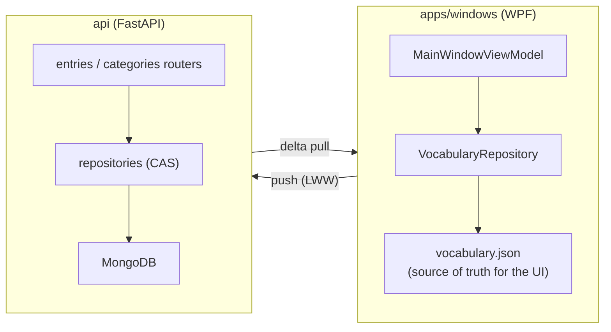

# LexiCall

A personal vocabulary tracker for words and expressions collected while reading:
organize them into a category hierarchy, search across everything instantly, and
keep the collection in sync across devices, without ever losing offline access to
a single word.

**Status**: the Windows desktop client is feature-complete and daily-driven; the
FastAPI/MongoDB backend is implemented and running in production on a VPS, wired
to the desktop client through a bidirectional, timestamp-based sync layer (details
below).

## Overview

LexiCall started as a personal itch: reading constantly surfaces words and
expressions worth keeping, and neither note-taking apps nor spreadsheets were
built for that: the former have no real structure for a growing vocabulary,
the latter fall apart past a couple hundred rows. This repository is what
came out of building that tool myself, end to end, from the desktop app I
use daily to the backend that keeps it in sync.

Two components exist today:

- **`apps/windows`**, a WPF/.NET desktop app: the primary way vocabulary gets
  collected, browsed, and edited.
- **`api`**, a FastAPI + MongoDB backend that mirrors the desktop client's data,
  deployed to a VPS behind a reverse proxy with automatic HTTPS.



The local JSON file is what the UI actually reads from; the API is a
best-effort mirror the client pushes to and pulls from, never a hard
dependency. Losing network access, or the API being down entirely, doesn't
touch the desktop app's usability at all.

## Design decisions

### Local-first storage

The desktop client's entire dataset lives in one JSON document
(`%LOCALAPPDATA%\LexiCall\vocabulary.json`), loaded into memory at startup and
rewritten whole on every mutation. No embedded database, no ORM, no schema
migrations to manage on the client. For a personal dataset that comfortably
fits in memory, this trades a small amount of write amplification (every save
rewrites the whole file) for something much more valuable at this scale:
zero moving parts, a format that's trivially readable/editable by hand, and
an app that works exactly the same with or without network access, because
nothing about reading or writing local data depends on it.

### Client ↔ server sync: Last-Write-Wins (LWW) over timestamps

This is the part of the codebase with the most going on, so it's worth
walking through in some depth.

**The problem.** Reading happens anywhere, so the client has to work fully
offline and catch up whenever a connection shows up again, without either
side having to guess what it missed in the meantime. The straightforward way
to guarantee nothing gets missed is to just re-send the entire local dataset
on every catch-up: simple, but it doesn't scale. At a few hundred entries,
that's several hundred sequential HTTP requests on every single startup,
most of them pushing data the server already has.

**The approach.** The sync layer is bidirectional, driven by a single
invariant: for any given record, the copy with the most recent `UpdatedAt`
wins, regardless of which device produced it. That invariant only holds up
in practice with a few supporting mechanisms:

- **Conditional writes instead of blind overwrites.** Every update on the
  server is a MongoDB `find_one_and_update` gated on
  `{"UpdatedAt": {"$lt": incoming}}`: the write only applies if the incoming
  timestamp is actually newer than what's stored. A push that arrives late
  (e.g. replayed after being queued while offline) simply loses that
  comparison instead of clobbering a more recent edit made elsewhere; losing
  the comparison isn't treated as an error, the server just returns the
  current winning copy.
- **Soft deletes.** Deleting a record sets an `IsDeleted` flag and bumps
  `UpdatedAt`, instead of removing the document. A hard delete would leave no
  trace for another device to ever learn "this was deleted" from; a
  tombstone is the one channel a deletion has to actually propagate.
- **Delta pulls instead of full re-fetches.** Reads take an optional
  `updated_since` watermark and return only what changed, including
  tombstones. The server hands back its own timestamp with every response
  (as a header), and the client persists that value verbatim as the next
  watermark, rather than trusting its own clock for anything that affects
  what gets fetched.
- **Per-record dirty tracking on the client**, instead of one global "last
  synced" checkpoint. Each local record remembers the `UpdatedAt` value it
  was last successfully pushed at; a resync only pushes records where that
  value is stale. This is what keeps a slow network from being a problem: a
  single record that keeps failing to push stays "dirty" on its own, without
  ever forcing a full re-push of everything else around it.
- **A short-interval background timer**, not just a push-on-mutation and a
  catch-up-on-launch. Network hiccups that resolve mid-session get picked up
  without waiting for the next app restart, guarded against overlapping with
  itself and against firing while an edit dialog is open.
- **Entry images live in their own MongoDB collection**, not as a field on
  the entry document. A Mongo projection that excludes a field only saves
  the client bandwidth; the storage engine still reads the whole document,
  image bytes included, into cache for any scan of the collection. Splitting
  images out keeps a growing entries collection fast to browse regardless of
  how many of them carry an image.

## Tech stack

| Component | Technology |
| --- | --- |
| Desktop app | .NET 10, C#, WPF |
| UI architecture | MVVM (hand-rolled, no toolkit) |
| Desktop storage | Local JSON |
| Backend | FastAPI, Pydantic |
| Database | MongoDB |
| Deployment | Docker Compose |

## Repository structure

Monorepo, one folder per surface:

```text
apps/
└── windows/   .NET/WPF desktop client
api/           FastAPI + MongoDB backend
```

`apps/windows` is fully self-contained: its own solution file, pinned SDK
version, and command runner live directly inside it. `api` is a separate
Python codebase with its own conventions and its own [justfile](api/justfile).

```text
apps/windows/
├── LexiCall.sln
├── global.json           pinned .NET SDK version
├── justfile               local run/build/test commands
└── src/
    ├── Models/             VocabularyEntry, VocabularyCategory, root JSON document
    ├── ViewModels/         MVVM state and presentation logic
    ├── Services/           local persistence, theming, API sync client
    ├── Commands/           WPF ICommand implementations
    ├── Converters/         XAML value converters
    ├── Utilities/          text parsing, category-hierarchy helpers
    ├── Themes/             light/dark color resources and shared styles
    └── *Window.xaml        main window + modal editors
```

## Getting started

**Prerequisites**: Windows 10/11, [.NET 10 SDK](https://dotnet.microsoft.com/download/dotnet/10.0).

```powershell
cd apps/windows
dotnet restore
dotnet build LexiCall.sln
dotnet run --project src/LexiCall.Desktop.csproj
```

Or, with [`just`](https://github.com/casey/just) installed, from the repo root:

```powershell
just run-app-windows
just build-app-windows
```

The app runs standalone with no configuration; sync only activates once an
API URL and key are entered in Options. See [`api/README.md`](api/README.md)
for backend setup.

## Usage

_Coming soon._
